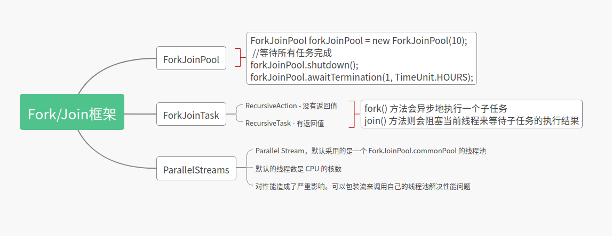

forkJoinPool是一个和ThreadPoolExecutor同级的线程池,拥有共同的父类AbstractExecutorService.

分治，顾名思义，即分而治之，是一种解决复杂问题的思维方法和模式；具体来讲，指的是把一个复杂的问题分解成多个相似的子问题，然后再把子问题分解成更小的子问题，直到子问题简单到可以直接求解。理论上来讲，解决每一个问题都对应着一个任务，所以对于问题的分治，实际上就是对于任务的分治。


Fork/Join 是一个并行计算的框架，主要就是用来支持分治任务模型的，这个计算框架里的 Fork 对应的是分治任务模型里的任务分解，Join 对应的是结果合并。
Fork/Join 计算框架主要包含两部分，一部分是分治任务的线程池 ForkJoinPool，另一部分是分治任务 ForkJoinTask。

ForkJoinTask 是一个抽象类，它的方法有很多，最核心的是 fork() 方法和 join() 方法:

* 其中 fork() 方法会异步地执行一个子任务
* 而 join() 方法则会阻塞当前线程来等待子任务的执行结果


ForkJoinTask 有两个子类——RecursiveAction 和 RecursiveTask ，通过名字你就应该能知道，它们都是用递归的方式来处理分治任务的。
这两个子类都定义了抽象方法 compute()，
不过区别是 RecursiveAction 定义的 compute() 没有返回值，而 RecursiveTask 定义的 compute() 方法是有返回值的。
这两个子类也是抽象类，在使用的时候，需要你定义子类去扩展。


Fork/Join 并行计算框架主要解决的是分治任务。分治的核心思想是“分而治之”：将一个大的任务拆分成小的子任务去解决，然后再把子任务的结果聚合起来从而得到最终结果。这个过程非常类似于大数据处理中的 MapReduce，所以你可以把 Fork/Join 看作单机版的 MapReduce。

Fork/Join 并行计算框架的核心组件是 ForkJoinPool。
它提供基本的线程池功能，支持设置最大并发线程数，支持任务排队，支持线程池停止，支持线程池使用情况监控，也是AbstractExecutorService的子类，主要引入了“工作窃取”机制，在多CPU计算机上处理性能更佳。
ForkJoinPool 支持任务窃取机制，能够让所有线程的工作量基本均衡，不会出现有的线程很忙，而有的线程很闲的状况，所以性能很好。

ForkJoinPool ：ForkJoinTask需要通过ForkJoinPool来执行，任务分割出的子任务会添加到当前工作线程所维护的双端队列中，进入队列的头部。当一个工作线程的队列里暂时没有任务时，它会随机从其他工作线程的队列的尾部获取一个任务。
　　
在线程池使用监控方面，主要通过如下方法：

- isTerminated—判断线程池对应的workQueue中是否有待执行任务未执行完；
- awaitTermination—判断线程池是否在约定时间内完成，并返回完成状态；
- getQueuedSubmissionCount—获取所有待执行的任务数；
- getRunningThreadCount—获取正在运行的任务数。


什么是工作窃取?

> work-stealing（工作窃取），ForkJoinPool提供了一个更有效的利用线程的机制，当ThreadPoolExecutor还在用单个队列存放任务时，ForkJoinPool已经分配了与线程数相等的队列，当有任务加入线程池时，会被平均分配到对应的队列上，各线程进行正常工作，当有线程提前完成时，会从队列的末端“窃取”其他线程未执行完的任务，当任务量特别大时，CPU多的计算机会表现出更好的性能。


Java 1.8 提供的 Stream API 里面并行流 ParallelStreams 也是以 ForkJoinPool 为基础的。不过需要你注意的是，默认情况下所有的并行流计算都共享一个 ForkJoinPool，这个共享的 ForkJoinPool 默认的线程数是 CPU 的核数；如果所有的并行流计算都是 CPU 密集型计算的话，完全没有问题，但是如果存在 I/O 密集型的并行流计算，那么很可能会因为一个很慢的 I/O 计算而拖慢整个系统的性能。所以建议用不同的 ForkJoinPool 执行不同类型的计算任务。

Java 8为ForkJoinPool添加了一个通用线程池，这个线程池用来处理那些没有被显式提交到任何线程池的任务。它是ForkJoinPool类型上的一个静态元素，它拥有的默认线程数量等于运行计算机上的处理器数量

在 java 8 中 添加了流Stream，可以让你以一种声明的方式处理数据。使用起来非常简单优雅。ParallelStream 则是一个并行执行的流，采用 ForkJoinPool 并行执行任务，提高执行速度。

Parallel Stream，默认采用的是一个 ForkJoinPool.commonPool 的线程池，这样我们就算使用了 Parallel Stream， 整个 jvm 共用一个 common pool 线程池，一不小心就任务堆积了.Java 8 并行流（parallel stream）采用共享线程池，对性能造成了严重影响。可以包装流来调用自己的线程池解决性能问题

```java
// 示例：自定义线程池
ForkJoinPool forkJoinPool = new ForkJoinPool(8);

// 这里是从数据库里查出来的一批代理 ip
List<ProxyList> records = new ArrayList<>();

// 找出失效的代理 ip
List<String> needDeleteList = forkJoinPool.submit(() -> records.parallelStream()
    .map(ProxyList::getIpPort)
    .filter(IProxyListTask::isFailed)
    .collect(Collectors.toList())
).join();

```

java 8 的并发流在大批量数据处理时可简化多线程的使用，在遇到耗时业务或者重度使用并发流不妨根据业务情况采用自定义线程池来提示处理速度。





提交任务:

* execute(Runnable)
* execute(ForkJoinTask) 异步执行tasks，无返回值
* invoke(ForkJoinTask) 有Join, tasks会被同步到主进程
* submit(ForkJoinTask) 异步执行，且带Task返回值，可通过task.get 实现同步到主线程
* submit(Runnable)
* submit(Callable)

> Runnable: 没有参数没有返回值
> Callable: 没有参数有返回值


execute 异步，无返回结果
submit 异步，有返回结果 （返回Future<T>）
invoke 同步，有返回结果 （会阻塞）


下面做一个实例

现在有一个int类型的list

```java
List<Integer> list = Arrays.asList(1, 2, 3, 4, 5, 6, 7, 8, 9, 10, 11, 12, 13, 14, 15, 16);
```

要计算list的和,类似下面的功能结果

```java
    int sum1 = list.stream().mapToInt(Integer::intValue).sum();
    System.out.println(sum1);
```

实现方式一: submit(Callable)

```java
List<Integer> list = Arrays.asList(1, 2, 3, 4, 5, 6, 7, 8, 9, 10, 11, 12, 13, 14, 15, 16);
ForkJoinPool forkJoinPool = new ForkJoinPool(10);
ForkJoinTask<Integer> task = forkJoinPool.submit(() -> list.stream().parallel().reduce(0, (sum, num) -> sum + num));
final Integer sum = task.get();
System.out.println(sum);

forkJoinPool.shutdown();
```


实现方式二:

```java

import java.util.List;
import java.util.concurrent.RecursiveTask;

public class SumTask extends RecursiveTask<Integer> {


    private List<Integer> list;

    public SumTask(List<Integer> list){
        System.out.println(Thread.currentThread().getName() + "---" + list.size());
        this.list = list;
    }

    @Override
    protected Integer compute() {
        Integer sum = 0;
        int size = list.size();
        if(size > 2){
            List<Integer> list1 = list.subList(0, size / 2);

            List<Integer> list2 = list.subList(size / 2, size);

            SumTask left = new SumTask(list1);
            SumTask right = new SumTask(list2);
            right.fork();
            left.fork();
            sum = right.join() + left.join();

        }else {

            sum += list.stream().mapToInt(Integer::intValue).sum();

        }
        return sum;
    }
}


```

```java
List<Integer> list = Arrays.asList(1, 2, 3, 4, 5, 6, 7, 8, 9, 10, 11, 12, 13, 14, 15, 16);
int sum = list.stream().mapToInt(Integer::intValue).sum();
System.out.println(sum);
ForkJoinPool forkJoinPool = new ForkJoinPool(3);
ForkJoinTask<Integer> task = forkJoinPool.submit(new SumTask(list));
Integer integer = task.get();
System.out.println(integer);
forkJoinPool.shutdown();
```

