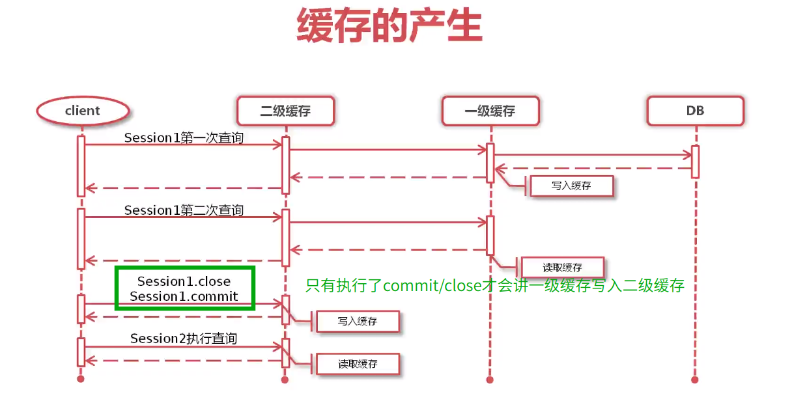

##　二级缓存

工作中很少用，因为有一些弊端(脏读,单线程,多线程,多实例)

> 很重要：po需要实现序列化接口
> 一级缓存在同一个sqlSession内，二级缓存在同一个sqlSessionFactory内

## 二级缓存的命中原则

同一个sqlSessionFactory内
两次查询是完全相同的查询且有缓存.

完全相同的查询:

1. statementId必须相同否则无法命中缓存,即使sql语句和参数完全相同
2. 查询参数全完相同(这里的查询参数是sql语句参数)
3. 分页参数必须相同(缓存的粒度是整个分页结果,不是结果中的每条)
4. 传递给sql语句的文本必须一样
5. 环境必须一样(dev/stage/prod不同环境不同的sql)

> 和一级缓存的命中原则完全一样

## 二级缓存的声明周期

产生:

1. 满足一级缓存的产生条件,在sql执行select后
2. session.commit或者close后

## 总结:

一级缓存,放心大胆的用,不会产生脏读(事物范围内),默认开启,然而没啥卵用(正因为在一个事物内,出现重复一模一样的查询基本不会出现)
二级缓存,小心谨慎使用或者直接不用,默认不开启,因为不管是单线程多线程多实例都会出现脏读问题,直接不用

