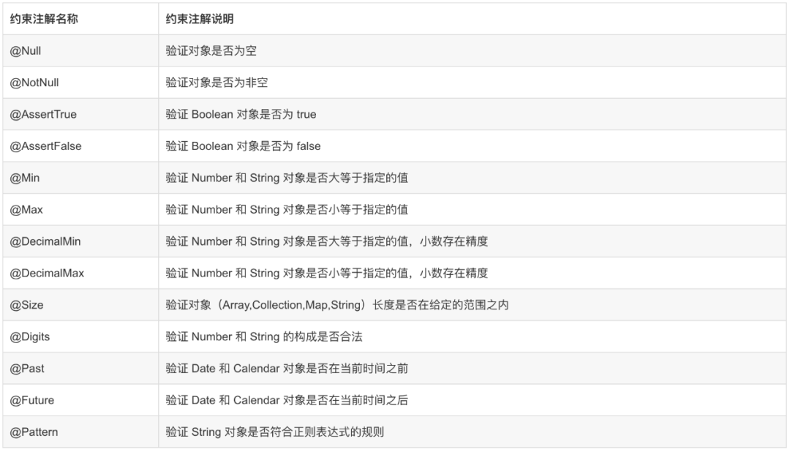

## 简介

JSR-303 是 JAVA EE 6 中的一项子规范，叫做 Bean Validation。

在任何时候，当你要处理一个应用程序的业务逻辑，数据校验是你必须要考虑和面对的事情。应用程序必须通过某种手段来确保输入进来的数据从语义上来讲是正确的。在通常的情况下，应用程序是分层的，不同的层由不同的开发人员来完成。很多时候同样的数据验证逻辑会出现在不同的层，这样就会导致代码冗余和一些管理的问题，比如说语义的一致性等。为了避免这样的情况发生，最好是将验证逻辑与相应的域模型进行绑定。

Bean Validation 为 JavaBean 验证定义了相应的元数据模型和 API。缺省的元数据是 Java Annotations，通过使用 XML 可以对原有的元数据信息进行覆盖和扩展。在应用程序中，通过使用 Bean Validation 或是你自己定义的 constraint，例如 @NotNull, @Max, @ZipCode， 就可以确保数据模型（JavaBean）的正确性。constraint 可以附加到字段，getter 方法，类或者接口上面。对于一些特定的需求，用户可以很容易的开发定制化的 constraint。Bean Validation 是一个运行时的数据验证框架，在验证之后验证的错误信息会被马上返回。

Bean Validation 规范内嵌的约束注解




## 实例

### 基本应用

引入依赖

```xml
<dependency>
    <groupId>org.springframework.boot</groupId>
    <artifactId>spring-boot-starter-validation</artifactId>
</dependency>
```

给参数对象添加校验注解

```java
@Data
public class User {

    private Integer id;

    @NotBlank(message = "用户名不能为空")
    private String username;

    @Pattern(regexp = "^(?![0-9]+$)(?![a-zA-Z]+$)[0-9A-Za-z]{8,16}$", message = "密码必须为8~16个字母和数字组合")
    private String password;

    @Email
    private String email;

    private Integer gender;

}

```

Controller 中需要校验的参数Bean前添加 @Valid 开启校验功能，紧跟在校验的Bean后添加一个BindingResult，BindingResult封装了前面Bean的校验结果。

```java
@RestController
@RequestMapping("/user")
public class UserController {
    @PostMapping("")
    public Result save (@Valid User user , BindingResult bindingResult)  {
        if (bindingResult.hasErrors()) {
            Map<String , String> map = new HashMap<>();
            bindingResult.getFieldErrors().forEach( (item) -> {
                String message = item.getDefaultMessage();
                String field = item.getField();
                map.put( field , message );
            } );
            return Result.build( 400 , "非法参数 !" , map);
        }
        return Result.ok();
    }

}
```


### 异常的统一处理

参数校验不通过时，会抛出 BingBindException 异常，可以在统一异常处理中，做统一处理，这样就不用在每个需要参数校验的地方都用 BindingResult 获取校验结果了。

```java
@Slf4j
@RestControllerAdvice(basePackages = "com.itwolfed.controller")
public class GlobalExceptionControllerAdvice {
    @ExceptionHandler(value= {MethodArgumentNotValidException.class , BindException.class})
    public Result handleVaildException(Exception e){
        BindingResult bindingResult = null;
        if (e instanceof MethodArgumentNotValidException) {
            bindingResult = ((MethodArgumentNotValidException)e).getBindingResult();
        } else if (e instanceof BindException) {
            bindingResult = ((BindException)e).getBindingResult();
        }
        Map<String,String> errorMap = new HashMap<>(16);
        bindingResult.getFieldErrors().forEach((fieldError)->
                errorMap.put(fieldError.getField(),fieldError.getDefaultMessage())
        );
        return Result.build(400 , "非法参数 !" , errorMap);
    }

}
```

### 分组解决校验

新增和修改对于实体的校验规则是不同的，例如id是自增的时候，新增时id要为空，修改则必须不为空；新增和修改，若用的恰好又是同一种实体，那就需要用到分组校验。

```java
public class Groups {
    public interface Add{}
    public interface  Update{}
}
```

给参数对象的校验注解添加分组

```java
@Data
public class User {

    @Null(message = "新增不需要指定id" , groups = Groups.Add.class)
    @NotNull(message = "修改需要指定id" , groups = Groups.Update.class)
    private Integer id;

    @NotBlank(message = "用户名不能为空")
    @NotNull
    private String username;

    @Pattern(regexp = "^(?![0-9]+$)(?![a-zA-Z]+$)[0-9A-Za-z]{8,16}$", message = "密码必须为8~16个字母和数字组合")
    private String password;

    @Email
    private String email;
    private Integer gender;

}
```
Controller 中原先的@Valid不能指定分组 ，需要替换成@Validated

```java
@RestController
@RequestMapping("/user")
public class UserController {
    @PostMapping("")
    public Result save (@Validated(Groups.Add.class) User user)  {
        return Result.ok();
    }

}
```

### 自定义校验注解

虽然JSR303和springboot-validator 已经提供了很多校验注解，但是当面对复杂参数校验时，还是不能满足我们的要求，这时候我们就需要 自定义校验注解。

例如User中的gender，用 1代表男 2代表女，我们自定义一个校验注解@ListValue，指定取值只能1和2。

创建约束规则

```java

import javax.validation.Constraint;
import javax.validation.Payload;
import java.lang.annotation.*;

import static java.lang.annotation.ElementType.*;
import static java.lang.annotation.RetentionPolicy.RUNTIME;

/**
 * @author user
 * @date 2020/5/20 上午9:42
 */
@Documented
@Constraint(validatedBy = { IntListValidator.class })
@Target({ METHOD, FIELD, ANNOTATION_TYPE })
@Retention(RUNTIME)
public @interface IntList {

    String message() default "";

    Class<?>[] groups() default { };

    Class<? extends Payload>[] payload() default { };

    int[] value() default { };

    @Target({ ElementType.FIELD, ElementType.METHOD, ElementType.PARAMETER, ElementType.ANNOTATION_TYPE })
    @Retention(RetentionPolicy.RUNTIME)
    @Documented
    @interface List {
        IntList[] value();
    }
}
```
一个标注(annotation) 是通过@interface关键字来定义的. 这个标注中的属性是声明成类似方法 的样式的. 根据Bean Validation API 规范的要求：

- message属性, 这个属性被用来定义默认得消息模版, 当这个约束条件被验证失败的时候,通过 此属性来输出错误信息。
- groups 属性, 用于指定这个约束条件属于哪(些)个校验组. 这个的默认值必须是Class<?>类型数组。
- payload 属性, Bean Validation API 的使用者可以通过此属性来给约束条件指定严重级别. 这个属性并不被API自身所使用。

除了这三个强制性要求的属性(message, groups 和 payload) 之外, 我们还添 加了一个属性用来指定所要求的值. 此属性的名称vals在annotation的定义中比较特 殊, 如果只有这个属性被赋值了的话, 那么, 在使用此annotation到时候可以忽略此属性名称.

另外, 我们还给这个annotation标注了一些元标注( meta annotatioins)：


- @Target({ METHOD, FIELD, ANNOTATION_TYPE }): 表示此注解可以被用在方法, 字段或者 annotation声明上。
- @Retention(RUNTIME): 表示这个标注信息是在运行期通过反射被读取的.
- @Constraint(validatedBy = ListValueConstraintValidator.class): 指明使用哪个校验器(类) 去校验使用了此标注的元素.
- @Documented: 表示在对使用了该注解的类进行javadoc操作到时候, 这个标注会被添加到 javadoc当中.


创建约束校验器

```java

import javax.validation.ConstraintValidator;
import javax.validation.ConstraintValidatorContext;
import java.util.HashSet;
import java.util.Set;

/**
 * @author user
 * @date 2020/5/20 上午9:51
 */
public class IntListValidator implements ConstraintValidator<IntList,Integer> {

    private final Set<Integer> set = new HashSet<>();

    @Override
    public void initialize(IntList constraintAnnotation) {

        int[] ints = constraintAnnotation.value();
        for (int val : ints) {
            set.add(val);
        }

    }


    @Override
    public boolean isValid(Integer value, ConstraintValidatorContext context) {

        return set.contains(value);
    }
}
```

ListValueConstraintValidator定义了两个泛型参数, 第一个是这个校验器所服务到标注类型(在我们的例子中即ListValue), 第二个这个校验器所支持到被校验元素的类型 (即Integer)。

如果一个约束标注支持多种类型的被校验元素的话, 那么需要为每个所支持的类型定义一个ConstraintValidator,并且注册到约束标注中。

这个验证器的实现就很平常了, initialize() 方法传进来一个所要验证的标注类型的实例, 在本 例中, 我们通过此实例来获取其vals属性的值,并将其保存为Set集合中供下一步使 用。

isValid()是实现真正的校验逻辑的地方, 判断一个给定的int对于@ListValue这个约束条件来说 是否是合法的。

在参数对象中使用@ListValue注解。

```java
@Data
public class User {
    @Null(message = "新增不需要指定id" , groups = Groups.Add.class)
    @NotNull(message = "修改需要指定id" , groups = Groups.Update.class)
    private Integer id;

    @NotBlank(message = "用户名不能为空")
    @NotNull
    private String username;

    @Pattern(regexp = "^(?![0-9]+$)(?![a-zA-Z]+$)[0-9A-Za-z]{8,16}$", message = "密码必须为8~16个字母和数字组合")
    private String password;

    @Email
    private String email;

    @IntList( message = "性别应指定相应的值" , vals = {1,2} , groups = {Groups.Add.class , Groups.Update.class})
    private Integer gender;

}
```

> 1. 如果被校验的bean需要分组,需要注解@Validated @Valid不支持分组
> 2. 如果要在方法参数上做校验,controller上需要加注解@Validated
> 3. @Validated是spring的注解,看来spring是做了做了加强的


```java
@RestController
@Slf4j
@RequestMapping("item-prop")
@Validated
public class ItemPropController {

    private final ItemPropService itemPropService;

    @Autowired
    public ItemPropController(ItemPropService itemPropService) {
        this.itemPropService = itemPropService;
    }

    @PostMapping("add/{orgId}")
    public Object addItemProp(@PathVariable("orgId")String orgId, @Validated(Groups.Add.class) @RequestBody ItemPropVo itemPropVo) throws  Exception {
        log.info("===[orgId={}, body={}]", orgId, itemPropVo);
        ItemPropPo itemPropPo = new ItemPropPo();
        BeanUtils.copyProperties(itemPropVo, itemPropPo);
        itemPropService.add(itemPropPo);
        return of(null, SUCCESS);
    }
}

```

## 附录
### 表 1. Bean Validation 中内置的 constraint

* @Null   被注释的元素必须为 null
* @NotNull    被注释的元素必须不为 null
* @AssertTrue 被注释的元素必须为 true
* @AssertFalse    被注释的元素必须为 false
* @Min(value) 被注释的元素必须是一个数字，其值必须大于等于指定的最小值
* @Max(value) 被注释的元素必须是一个数字，其值必须小于等于指定的最大值
* @DecimalMin(value)  被注释的元素必须是一个数字，其值必须大于等于指定的最小值
* @DecimalMax(value)  被注释的元素必须是一个数字，其值必须小于等于指定的最大值
* @Size(max, min) 被注释的元素的大小必须在指定的范围内
* @Digits (integer, fraction) 被注释的元素必须是一个数字，其值必须在可接受的范围内
* @Past   被注释的元素必须是一个过去的日期
* @Future 被注释的元素必须是一个将来的日期
* @Pattern(value) 被注释的元素必须符合指定的正则表达式

### 表 2. Hibernate Validator 附加的 constraint

* @Email  被注释的元素必须是电子邮箱地址
* @Length 被注释的字符串的大小必须在指定的范围内
* @NotEmpty   被注释的字符串的必须非空
* @Range  被注释的元素必须在合适的范围内


