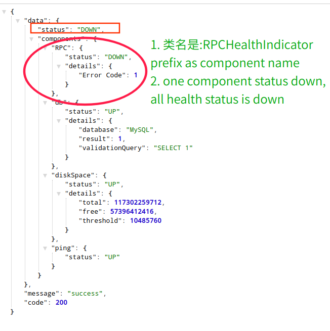
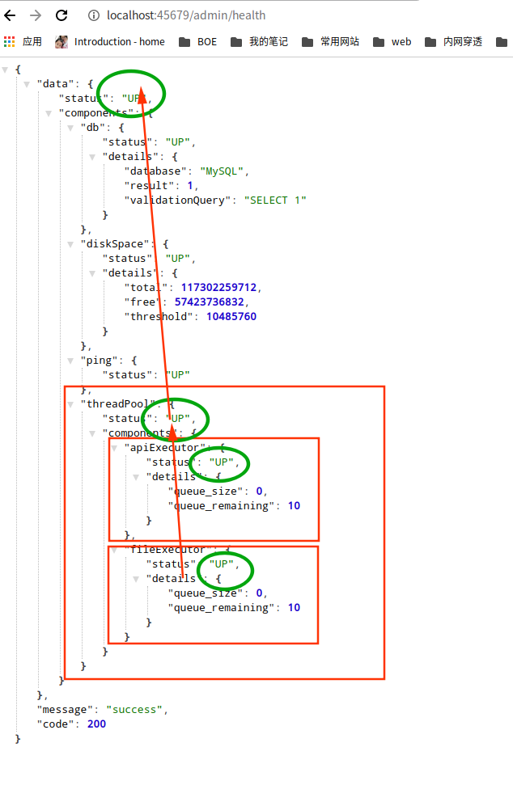

## 1. 准备工作

```xml
<dependency>
    <groupId>org.springframework.boot</groupId>
    <artifactId>spring-boot-starter-actuator</artifactId>
</dependency>
```


1. 如果你不希望 Web 应用的 Actuator 管理端口和应用端口重合的话，可以使用 management.server.port 设置独立的端口。
2. Actuator 自带了很多开箱即用提供信息的端点（Endpoint），可以通过 JMX 或 Web 两种方式进行暴露。
考虑到有些信息比较敏感，这些内置的端点默认不是完全暴露的，你可以通过 [官网](https://docs.spring.io/spring-boot/docs/current/reference/html/production-ready-features.html#production-ready-endpoints-exposing-endpoints) 查看这些默认值。在这里，为了方便后续 Demo，我们设置所有端点通过 Web 方式暴露。
3. 默认情况下，Actuator 的 Web 访问方式的根地址为 /actuator，可以通过 management.endpoints.web.base-path 参数进行修改。我来演示下，如何将其修改为 /admin。


```properties
# 默认和web端口是同一个端口 server.port 默认是8080
management.server.port=45679
# web默认只有health和info开启, jmx默认全部开启
management.endpoints.web.exposure.include=*
# springboot2.x 默认为actuator
management.endpoints.web.base-path=/admin
```

其中，大部分端点提供的是只读信息，比如查询 Spring 的 Bean、ConfigurableEnvironment、定时任务、SpringBoot 自动配置、Spring MVC 映射等；少部分端点还提供了修改功能，比如优雅关闭程序、下载线程 Dump、下载堆 Dump、修改日志级别等。

你可以访问 [这里](https://docs.spring.io/spring-boot/docs/2.2.4.RELEASE/actuator-api//html/#shutdown)，查看所有这些端点的功能，详细了解它们提供的信息以及实现的操作。此外，我再分享一个不错的 Spring Boot 管理工具 [Spring Boot Admin](https://github.com/codecentric/spring-boot-admin)，它把大部分 Actuator 端点提供的功能封装为了 Web UI。


> shutdown默认是关闭的,需要单独开启: management.endpoint.shutdown.enabled=true
> curl localhost:45679/admin/shutdown -X POST


**总结:**

1. 默认所有的endpoint是开启的.除了`shutdown`. 开启shutdown: `management.endpoint.shutdown.enabled=true`

    ```bash
    # post方法
    curl localhost:45679/admin/shutdown -X POST
    ```

2. 如果想要默认所有的endpoint是关闭的,可以通过配置`management.endpoints.enabled-by-default=false`,再单独开启某一项

    ```properties
    management.endpoints.enabled-by-default=false
    management.endpoint.info.enabled=true

    ```
3. endpoints暴露方式默认有两种:
    * JMX: 默认所有的endpoint都暴露
    * Web: 默认只有info和health暴露

    |Property  |  Default   |
    | -------- | ---------  |
    | management.endpoints.jmx.exposure.exclude |              |
    | management.endpoints.jmx.exposure.include | *            |
    | management.endpoints.web.exposure.exclude |              |
    | management.endpoints.web.exposure.include | info, health |


## reference

1. https://docs.spring.io/spring-boot/docs/current/reference/html/production-ready-features.html#production-ready-endpoints-exposing-endpoints
2. https://docs.spring.io/spring-boot/docs/2.2.4.RELEASE/actuator-api//html/#shutdown
3. https://github.com/codecentric/spring-boot-admin


## 健康检测需要触达关键组件

Spring Boot Actuator 帮我们预先实现了诸如数据库、InfluxDB、Elasticsearch、Redis、RabbitMQ 等三方系统的健康检测指示器 HealthIndicator。

通过 Spring Boot 的自动配置，这些指示器会自动生效。当这些组件有问题的时候，HealthIndicator 会返回 DOWN 或 OUT_OF_SERVICE 状态，health 端点 HTTP 响应状态码也会变为 503，我们可以以此来配置程序健康状态监控报警。

```properties

management.endpoint.health.show-details=always
```


```bash
curl localhost:45679/admin/health |jq .

{
  "data": {
    "status": "UP",
    "components": {
      "db": {
        "status": "UP",
        "details": {
          "database": "MySQL",
          "result": 1,
          "validationQuery": "SELECT 1"
        }
      },
      "diskSpace": {
        "status": "UP",
        "details": {
          "total": 117302259712,
          "free": 57397047296,
          "threshold": 10485760
        }
      },
      "ping": {
        "status": "UP"
      }
    }
  },
  "message": "success",
  "code": 200
}

```

> 最外面包裹了一层,这是因为项目中设置了统一包装http返回体

## 自定义HealthIndicators


```java

import org.springframework.boot.actuate.health.Health;
import org.springframework.boot.actuate.health.HealthIndicator;
import org.springframework.stereotype.Component;

import java.util.Random;

@Component
public class RPCHealthIndicator implements HealthIndicator {

    @Override
    public Health health() {

        int errorCode = check(); // perform some specific health check

        if (errorCode != 0) {
            return Health.down().withDetail("Error Code", errorCode).build();
        }

        return Health.up().withDetail("Code", 200).build();
    }

    private int check(){
        return new Random().nextInt(2);
    }

}
```

```bash
curl localhost:45679/admin/health | jq .


{
  "data": {
    "status": "DOWN",
    "components": {
      "RPC": {
        "status": "DOWN",
        "details": {
          "Error Code": 1
        }
      },
      "db": {
        "status": "UP",
        "details": {
          "database": "MySQL",
          "result": 1,
          "validationQuery": "SELECT 1"
        }
      },
      "diskSpace": {
        "status": "UP",
        "details": {
          "total": 117302259712,
          "free": 57396441088,
          "threshold": 10485760
        }
      },
      "ping": {
        "status": "UP"
      }
    }
  },
  "message": "success",
  "code": 200
}

```




## 自定义组合HealthIndicators

当一个 demoThreadPool 为 DOWN 导致父 threadPools 为 DOWN，进一步导致整个程序的 status 为 DOWN：



```java

import com.google.common.util.concurrent.ThreadFactoryBuilder;
import org.springframework.context.annotation.Bean;
import org.springframework.context.annotation.Configuration;

import java.util.concurrent.ArrayBlockingQueue;
import java.util.concurrent.ThreadPoolExecutor;
import java.util.concurrent.TimeUnit;

/**
 * @author user
 */
@Configuration
public class ExecutorConfig {


    @Bean("fileProcessExecutor")
    public ThreadPoolExecutor fileProcessExecutor() {
        ThreadPoolExecutor fileProcessExecutor = new ThreadPoolExecutor(

                5, 10,

                60, TimeUnit.SECONDS,

                new ArrayBlockingQueue<>(10),

                new ThreadFactoryBuilder().setNameFormat("file-thread-pool-%d").build());

        fileProcessExecutor.allowCoreThreadTimeOut(false);
        fileProcessExecutor.setRejectedExecutionHandler(new ThreadPoolExecutor.CallerRunsPolicy());

        return fileProcessExecutor;
    }


    @Bean("apiProcessExecutor")
    public ThreadPoolExecutor apiProcessExecutor() {
        ThreadPoolExecutor apiProcessExecutor = new ThreadPoolExecutor(

                5, 10,

                60, TimeUnit.SECONDS,

                new ArrayBlockingQueue<>(10),

                new ThreadFactoryBuilder().setNameFormat("file-thread-pool-%d").build());

        apiProcessExecutor.allowCoreThreadTimeOut(false);
        apiProcessExecutor.setRejectedExecutionHandler(new ThreadPoolExecutor.CallerRunsPolicy());

        return apiProcessExecutor;
    }


}

```


```java

import org.springframework.boot.actuate.health.Health;
import org.springframework.boot.actuate.health.HealthIndicator;

import java.util.HashMap;
import java.util.Map;
import java.util.concurrent.ThreadPoolExecutor;

/**
 * @author user
 * @date 2020/5/25 上午10:09
 */

public class ThreadPoolHealthIndicator implements HealthIndicator {
    private ThreadPoolExecutor threadPool;

    public ThreadPoolHealthIndicator(ThreadPoolExecutor threadPool) {
        this.threadPool = threadPool;
    }
    @Override
    public Health health() {
        //补充信息

        Map<String, Integer> detail = new HashMap<>();
        //队列当前元素个数
        detail.put("queue_size", threadPool.getQueue().size());
        //队列剩余容量
        detail.put("queue_remaining", threadPool.getQueue().remainingCapacity());
        //如果还有剩余量则返回UP，否则返回DOWN
        if (threadPool.getQueue().remainingCapacity() > 0) {
            return Health.up().withDetails(detail).build();
        } else {
            return Health.down().withDetails(detail).build();
        }
    }
}

```

```java


import org.springframework.boot.actuate.health.CompositeHealthContributor;
import org.springframework.boot.actuate.health.HealthContributor;
import org.springframework.boot.actuate.health.NamedContributor;
import org.springframework.stereotype.Component;

import java.util.HashMap;
import java.util.Iterator;
import java.util.Map;
import java.util.concurrent.ThreadPoolExecutor;

/**
 * @author user
 * @date 2020/5/25 上午10:06
 */

@Component
public class ThreadPoolHealthContributor implements CompositeHealthContributor {

    private Map<String, HealthContributor> contributors = new HashMap<>();

    public ThreadPoolHealthContributor(ThreadPoolExecutor fileProcessExecutor, ThreadPoolExecutor apiProcessExecutor){
        contributors.put("fileExecutor", new ThreadPoolHealthIndicator(fileProcessExecutor));
        contributors.put("apiExecutor", new ThreadPoolHealthIndicator(apiProcessExecutor));
    }

    @Override
    public HealthContributor getContributor(String name) {

        //根据name找到某一个HealthContributor
        return contributors.get(name);
    }

    @Override
    public Iterator<NamedContributor<HealthContributor>> iterator() {

        //返回NamedContributor的迭代器，NamedContributor也就是Contributor实例+一个命名
        return contributors.entrySet().stream().map((entry) -> NamedContributor.of(entry.getKey(), entry.getValue())).iterator();
    }
}

```

以上，就是通过自定义 HealthContributor 和 CompositeHealthContributor，来实现监控检测触达程序内部诸如三方服务、线程池等关键组件，是不是很方便呢？

额外补充一下，Spring Boot 2.3.0增强了健康检测的功能，细化了 Liveness 和 Readiness 两个端点，便于 Spring Boot 应用程序和 Kubernetes 整合。

https://spring.io/blog/2020/03/25/liveness-and-readiness-probes-with-spring-boot


## 对外暴露应用内部重要组件的状态

除了可以把线程池的状态作为整个应用程序是否健康的依据外，我们还可以通过 Actuator 的 InfoContributor 功能，对外暴露程序内部重要组件的状态数据。这里，我会用一个例子演示使用 info 的 HTTP 端点、JMX MBean 这两种方式，如何查看状态数据。


```java

import org.springframework.boot.actuate.info.Info;
import org.springframework.boot.actuate.info.InfoContributor;
import org.springframework.stereotype.Component;

import java.util.HashMap;
import java.util.Map;
import java.util.concurrent.ThreadPoolExecutor;

/**
 * @author user
 * @date 2020/5/25 上午11:08
 */
@Component
public class ThreadPoolInfoContributor implements InfoContributor {

    private final ThreadPoolExecutor fileProcessExecutor;

    private final ThreadPoolExecutor apiProcessExecutor;


    ThreadPoolInfoContributor(ThreadPoolExecutor fileProcessExecutor, ThreadPoolExecutor apiProcessExecutor){
        this.fileProcessExecutor = fileProcessExecutor;
        this.apiProcessExecutor = apiProcessExecutor;
    }


    private static Map threadPoolInfo(ThreadPoolExecutor threadPool) {

        Map<String, Object> info = new HashMap<>();

        info.put("poolSize", threadPool.getPoolSize());
        info.put("corePoolSize", threadPool.getCorePoolSize());
        info.put("largestPoolSize", threadPool.getLargestPoolSize());
        info.put("maximumPoolSize", threadPool.getMaximumPoolSize());
        info.put("completedTaskCount", threadPool.getCompletedTaskCount());

        return info;

    }

    @Override
    public void contribute(Info.Builder builder) {

        builder.withDetail("demoThreadPool", threadPoolInfo(fileProcessExecutor));
        builder.withDetail("ioThreadPool", threadPoolInfo(apiProcessExecutor));

    }

}

```


```bash

curl localhost:45679/admin/info | jq .
{
    "demoThreadPool": {
      "largestPoolSize": 0,
      "poolSize": 0,
      "corePoolSize": 5,
      "completedTaskCount": 0,
      "maximumPoolSize": 10
    },
    "ioThreadPool": {
      "largestPoolSize": 0,
      "poolSize": 0,
      "corePoolSize": 5,
      "completedTaskCount": 0,
      "maximumPoolSize": 10
    }
}
```


