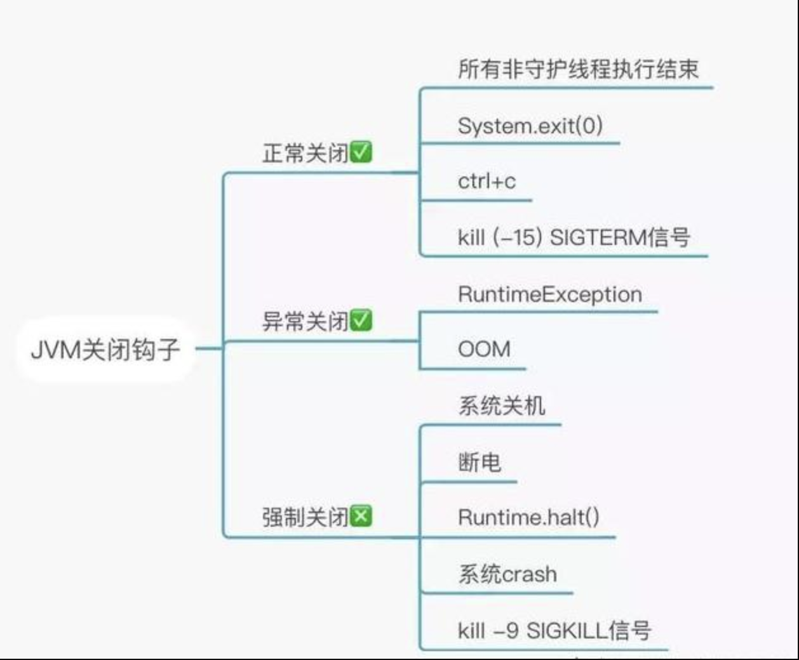

spring boot在启动过程中增加事件监听机制，为用户功能拓展提供极大的便利。





支持的事件类型四种:

1. ApplicationStartedEvent
2. ApplicationEnvironmentPreparedEvent
3. ApplicationPreparedEvent
4. ApplicationFailedEvent

实现监听步骤：

1.监听类实现ApplicationListener接口
2.将监听类添加到SpringApplication实例

```java
package com.example.demo.config;
import java.util.concurrent.Executor;
import java.util.concurrent.ThreadPoolExecutor;
import java.util.concurrent.TimeUnit;
import org.apache.catalina.connector.Connector;
import org.springframework.boot.web.embedded.tomcat.TomcatServletWebServerFactory;
import org.springframework.boot.web.servlet.server.ServletWebServerFactory;
import org.springframework.context.ApplicationListener;
import org.springframework.context.annotation.Bean;
import org.springframework.context.annotation.Configuration;
import org.springframework.context.event.ContextClosedEvent;
import lombok.extern.slf4j.Slf4j;
/**
 * ShutdownApp
 */
@Configuration
@Slf4j
public class ShutdownApp implements ApplicationListener<ContextClosedEvent>{
    private static volatile Connector connector;
    private final int waitTime = 30;
    @Override
    public void onApplicationEvent(ContextClosedEvent event) {
        log.info("..........................................................");
        log.info("...................SHUTDOWN NOW...........................");
        log.info("..........................................................");
       long startTime =  System.currentTimeMillis();
        //tomcat暂停对外服务
        connector.pause();
        //获取tomcat线程池
        Executor executor = connector.getProtocolHandler().getExecutor();
        if(executor instanceof ThreadPoolExecutor){
            try {
                 ThreadPoolExecutor threadPoolExecutor = (ThreadPoolExecutor) executor;
                 //线程池优雅停止，不接收新请求，等待任务完成后，关闭线程池
                 threadPoolExecutor.shutdown();
                 //阻塞等待一定的时间
                 if (threadPoolExecutor.awaitTermination(waitTime, TimeUnit.SECONDS)) {
                     log.info(String.format("Tomcat thread pool closed, time : %s ms", System.currentTimeMillis() - startTime));
                 }else {
                     log.warn("web 应用关闭时长超过最大时长：{} 秒，将进行强制关闭", waitTime);
                     threadPoolExecutor.shutdownNow();
                     if (!threadPoolExecutor.awaitTermination(waitTime, TimeUnit.SECONDS)) {
                        log.error("web应用关闭失败");
                     }
                 }
            } catch (Exception e) {
                Thread.currentThread().interrupt();
            }
        }
    }
    @Bean
    public ServletWebServerFactory servletContainer() {
       TomcatServletWebServerFactory tomcat = new TomcatServletWebServerFactory();
       tomcat.addConnectorCustomizers(connect -> {
           connector = connect;
        });
       return tomcat;
    }
}
```

还有另一个写法，原理是相同的，可以参考
https://www.toutiao.com/a6746465964172247563/?tt_from=android_share&utm_campaign=client_share&timestamp=1570844426&app=news_article&utm_source=email&utm_medium=toutiao_android&req_id=201910120940260100140470811D5F0188&group_id=6746465964172247563

## 如何优雅的关闭线程池和tomcat线程池关闭的原理相同

```java
@Bean("taskExecutor")
 public Executor taskExecutor() {
 ThreadPoolTaskScheduler executor = new ThreadPoolTaskScheduler();
 executor.setPoolSize(20);
 executor.setThreadNamePrefix("taskExecutor-");
 executor.setWaitForTasksToCompleteOnShutdown(true);//线程池关闭的时候等待所有任务都完成
 executor.setAwaitTerminationSeconds(60);//设置线程池中任务的等待时间，如果超过这个时候还没有销毁就强制销毁，以确保应用最后能够被关闭，而不是阻塞住
 return executor;
 }
threadPool.shutdown(); // Disable new tasks from being submitted
// 设定最大重试次数
try {
    // 等待 60 s
    if (!threadPool.awaitTermination(60, TimeUnit.SECONDS)) {
        // 调用 shutdownNow 取消正在执行的任务
        threadPool.shutdownNow();
        // 再次等待 60 s，如果还未结束，可以再次尝试，或者直接放弃
        if (!threadPool.awaitTermination(60, TimeUnit.SECONDS))
            System.err.println("线程池任务未正常执行结束");
    }
} catch (InterruptedException ie) {
    // 重新调用 shutdownNow
    threadPool.shutdownNow();
}
```

## 如何优雅的关闭docker

### docker stop 与 docker kill 的区别

Docker本身提供了两种终止容器运行的方式，即docker stop与docker kill。

docker stop

先来说说docker stop吧，当我们用docker stop命令来停掉容器的时候，docker默认会允许容器中的应用程序有10秒的时间用以终止运行
在docker stop命令执行的时候，会先向容器中PID为1的进程发送系统信号SIGTERM，然后等待容器中的应用程序终止执行，如果等待时间达到设定的超时时间，或者默认的10秒，会继续发送SIGKILL的系统信号强行kill掉进程。在容器中的应用程序，可以选择忽略和不处理SIGTERM信号，不过一旦达到超时时间，程序就会被系统强行kill掉，因为SIGKILL信号是直接发往系统内核的，应用程序没有机会去处理它。在使用docker stop命令的时候，我们唯一能控制的是超时时间，比如设置为20秒超时:
docker stop --time=20 container_name
docker stop -t container_name

docker kill

接着我们来看看docker kill命令，默认情况下，docker kill命令不会给容器中的应用程序有任何gracefully shutdown的机会。它会直接发出SIGKILL的系统信号，以强行终止容器中程序的运行。通过查看docker kill命令的帮助，我们可以看到，除了默认发送SIGKILL信号外，还允许我们发送一些自定义的系统信号：
其实不难看出，docker stop命令，更类似于Linux系统中的kill命令，二者都是发送系统信号SIGTERM。而docker kill命令，更像是Linux系统中的kill -9或者是kill -SIGKILL命令，用来发送SIGKILL信号，强行终止进程。

    kill -15 ：SIGTERM
    kill -9 : SIGKILL
    kill pid 默认就是kill -15


